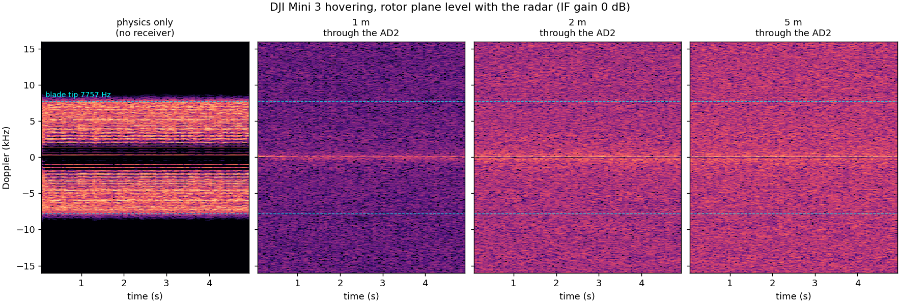
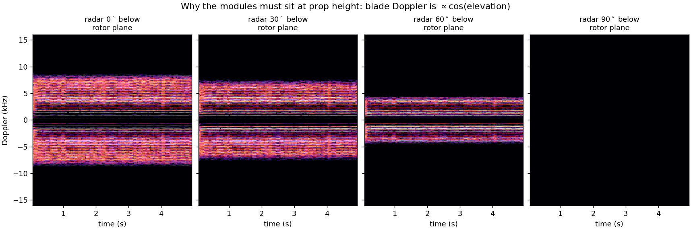
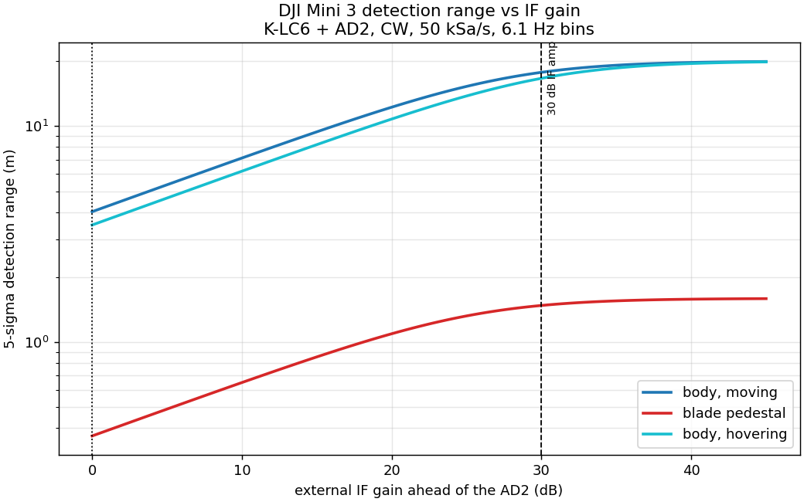
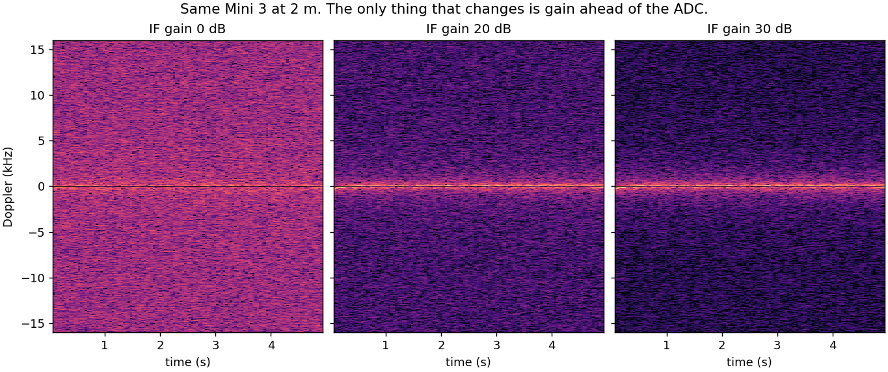
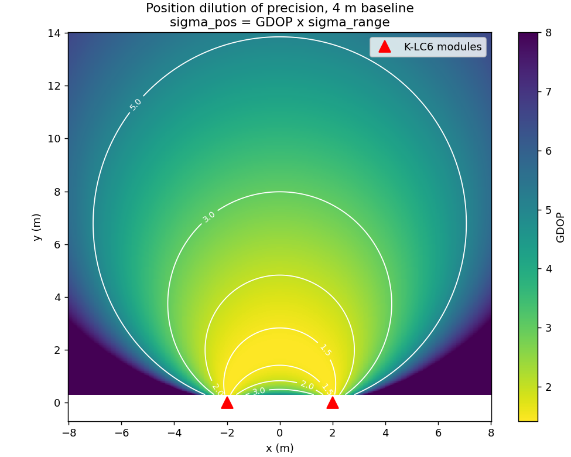
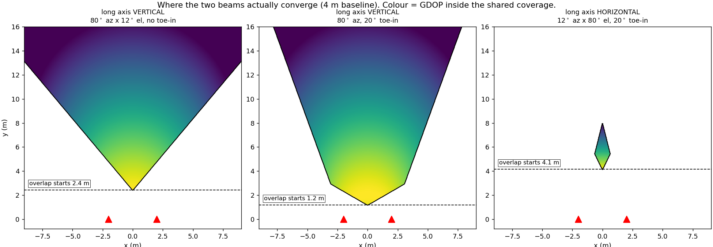
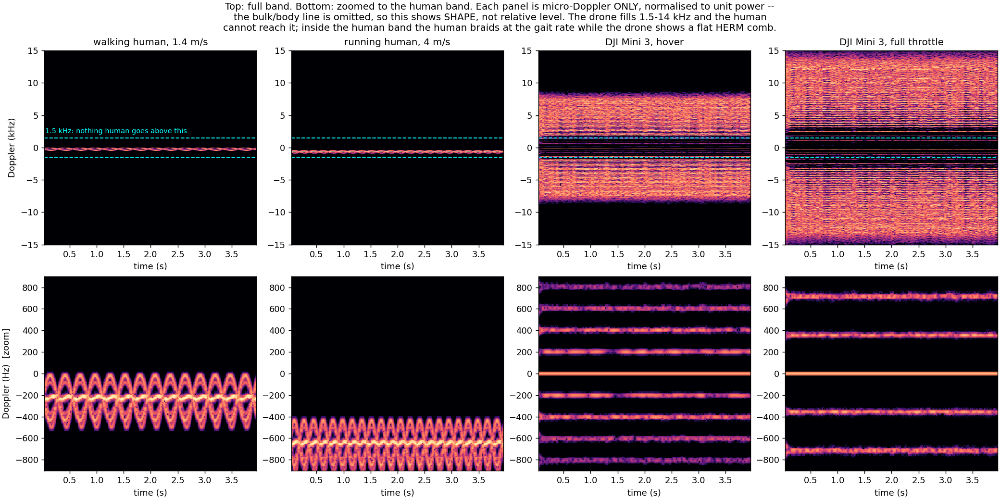

# Two-Radar Demo — DJI Mini 3 Position and Micro-Doppler

**Question asked:** two K-LC6 modules with converging coverage, positioning a
DJI Mini 3 in the overlap. How good is the micro-Doppler, at what range, and
what should we expect?

**Reproduce every number here with `python scripts/demo_budget.py`.** Figures in
`out/demo/`, simulated captures in `out/sim/`, model in `sim/`. Nothing below is
a bench measurement of a drone — we have never pointed this radar at one. It is
a datasheet-and-physics prediction, calibrated against the measurements this
repo *does* have, with the confidence stated at each step.

---

## 1. VERDICT

**The positioning demo works. The micro-Doppler demo does not, at any useful
range, until an IF amplifier exists.** These are two different demos with range
limits an order of magnitude apart, and conflating them is the main way this
goes wrong in front of an audience.

| what you want to show | range today | range with 30 dB IF amp |
|---|---|---|
| **2-D position of a MOVING Mini 3** | **~4 m** | **~18 m** |
| **2-D position of a HOVERING Mini 3** | **0.4–1.6 m** | **1.5–5 m** |
| blade micro-Doppler (classification) | 0.4–1.6 m | 1.5–5 m |
| HERM / cadence line | 0.3 m | 1.3 m |

**Read the hover row carefully — it is the counter-intuitive one.** The
noise-limited number for a hovering drone's *body* line is 3.5 m / 16.7 m,
almost as good as a mover, and §5's table reports it. **Do not use it.** A
hovering Mini 3 sits at ~30 Hz Doppler, and holds station to roughly
0.1–0.3 m/s radial — straddling the 0.25 m/s zero-Doppler notch that MTI and
`track.py` apply to kill room clutter. Widen the notch enough to suppress the
room and you delete the drone with it. This is `FINDINGS.md` §5.5 biting
exactly as documented: static targets are invisible, movers are strong, and a
hovering drone is nearly static.

So a **reliable** hover detection is forced onto the blade signature, which
caps it at the micro-Doppler range. **Hover is the hard case; forward flight is
the easy one.** Fly the drone in the positioning demo.

Position accuracy inside the overlap, with a 4 m baseline: **0.35 m at 2 m,
0.44 m at 4 m, 0.75 m at 8 m**, degrading as range² beyond that.

The three things that decide whether this works, in order of impact:

1. **An IF amplifier.** The AD2 — not the K-LC6 — is throwing away **25.5 dB**
   of sensitivity. 30 dB of gain ahead of the ADC recovers 24.2 of it and
   multiplies every range in the table by ~4.
2. **Mount the modules with the long axis vertical.** That gives an 80°
   azimuth fan. Mounted the other way the two 12° beams overlap in a region
   about 1 m across (`out/demo/coverage.png`, right panel) and the demo has
   no working volume at all.
3. **Put the modules at prop height.** Blade Doppler scales as cos(elevation).
   From 60° below, 0.3% of blade energy survives above 4 kHz; from directly
   underneath, none does.

**One genuinely good piece of news.** The Mini 3's blade tips land at
**7.76 kHz** at hover. The measured mains comb that wrecked the fan study is
dead by ~6 kHz — at 7740 Hz it is +0.5 dB over the floor, i.e. gone. Unlike the
fan, whose 2.4–4.0 kHz tips sat in the middle of the junk, **a drone's blade
signature lands in the cleanest part of this receiver's spectrum.** The fan
result does not transfer.

---

## 2. Hardware truth — RFbeam K-LC6 datasheet rev 1.2

Transcribed into `sim/klc6.py`. The numbers that matter:

| parameter | value | consequence |
|---|---|---|
| Output power EIRP | +16 / **+18** / +20 dBm | |
| Antenna gain | 12.5 dBi | note 2: *"theoretical value, given by design"* |
| Beam aperture | **12° × 80°** | the 12° lobe is along the module's long axis |
| Overall sensitivity | −126 dBc @ 1 kHz, S/N 6 dB | |
| IF noise voltage | **45 nV/√Hz** | the physics floor; we are 25 dB above it |
| IF bandwidth (bare) | 0 – 50 MHz | clips nothing |
| VCO input | **1 – 10 V**, 25 MHz/V, 250 MHz total | see §6 — we use 4 V of 9 |
| IF output offset | ±0.2 V | an IF amp must be AC-coupled |
| Supply | 5 V, 50–70 mA | 2 modules ≈ 140 mA |

Three corrections to assumptions currently in the repo:

- **`README.md` says "the 80° azimuth fan is wide".** The datasheet puts the
  **12°** lobe along the module's long axis and calls that azimuth. Which
  becomes azimuth is a mounting choice, but it is a choice, and it is currently
  undocumented. For the two-radar demo it is *the* mechanical decision.
- **`SPEC.md` §10.2 assumes a 300 MHz sweep.** The datasheet says **250 MHz**
  over the full 1–10 V. `FINDINGS.md` §5.3 already caught this empirically
  (~180 MHz); the datasheet explains why.
- **`FINDINGS.md` §5.1 says the pull-up is 4.7 kΩ.** Datasheet says **10 kΩ**
  to 5 V, open-circuit = 5 V. Doesn't change the verified conclusion that W1
  drives it fine.

**If you are considering the K-LC6_V2** (same module with a 20 dB IF amp
built in — otherwise exactly what this project needs): its IF bandwidth is
**10 Hz – 15 kHz**. A Mini 3 at full throttle puts blade tips at 13.7 kHz,
right on that shoulder. It is enough for a Mini 3 and not enough for a faster
rotor. An external amp with a wider band is the safer buy.

---

## 3. Target — DJI Mini 3

248 g, 251 × 362 × 72 mm unfolded, 6030F props (6 in diameter, 3 in pitch,
2 blades), 1504C motors, **6040 rpm hovering, 10700 rpm maximum**.

| condition | rpm | tip speed | tip Doppler | HERM spacing |
|---|---|---|---|---|
| hover | 6040 | 48.2 m/s | **7 757 Hz** | 201.3 Hz |
| mid throttle | 8000 | 63.8 m/s | 10 274 Hz | 266.7 Hz |
| maximum | 10700 | 85.4 m/s | **13 742 Hz** | 356.7 Hz |

At 50 kSa/s the Nyquist limit is 25 kHz, which clears even max throttle with
margin. `SPEC.md` §1's "quad blade tips 75–95 m/s → 12–15 kHz" is right for
full throttle but ~1.8× too fast for hover, which is the condition you will
actually capture.

**RCS is the weakest number in this analysis.** No published Mini 3 RCS at
24 GHz exists that I could find. Nearest measured neighbours:

| drone | RCS | band |
|---|---|---|
| DJI Inspire 1 Pro | −11.1 dBsm | 25 GHz |
| DJI Phantom 4 Pro | −12.4 dBsm | 25 GHz |
| DJI Phantom 3 | −13 to −14 dBsm | 24 GHz |

The Mini 3 is 0.71× the diagonal and 0.18× the mass of a Phantom 4, so
projected-area scaling puts it 3–5 dB lower: **−17 dBsm, ±5 dB.** Blade returns
measure **20–40 dB below the body** at K-band (Rahman & Robertson), ~30 dB for
a Phantom 3 — so **−47 dBsm** for the Mini 3's rotors, and that is used
throughout. It is an estimate stacked on an estimate; §8 bounds what it costs.

---

## 4. What the micro-Doppler actually looks like

`sim/drone.py` models each blade as a line of scatterers and computes slant
range to every segment each sample. Flashes, HERM comb and Doppler pedestal all
emerge from the phase sum — none of them are drawn in.

Left panel is the physics with no receiver: a filled pedestal bounded exactly
at ±7757 Hz, HERM lines every 201 Hz, four independent combs because the four
rotors run at slightly different speeds to hold attitude. That is the real
signature, and it is unmistakable.

The remaining panels are the same signal through the real front end at 1, 2 and
5 m. **The body line survives; the blade pedestal does not.** That single
picture is the whole finding.

### Geometry is not a detail

Measured from the simulation — fraction of blade energy above 4 kHz:

| radar elevation below rotor plane | energy > 4 kHz | energy > 6 kHz |
|---|---|---|
| **0° (level — correct)** | **64.2%** | 30.5% |
| 30° below | 54.7% | 14.0% |
| 60° below | 0.3% | 0.0% |
| 90° (directly beneath) | 0.0% | 0.0% |

At 90° every blade element moves tangentially and the signature collapses onto
DC — into the worst part of the spectrum, under the mains. This is
`FINDINGS.md` trap 7 reproducing itself, as it must for the model to be
trustworthy. **A drone hovering 2 m above two ground-mounted modules is
micro-Doppler-invisible.** Put the modules at hover altitude.

---

## 5. Detection range — the numbers

CW, 50 kSa/s, 8192-point FFT (6.1 Hz bins), 5σ required. Blade pedestal treated
as band energy over 4 kHz–7757 Hz (615 bins), which is the right detector for a
spread target and the one the fan study used.

| feature | no amp | +20 dB | +30 dB | +40 dB |
|---|---|---|---|---|
| body line, drone **moving** | 4.02 m | 12.24 m | 17.76 m | 19.72 m |
| body line, drone hovering | 3.49 m | 10.79 m | 16.66 m | 19.51 m |
| **blade pedestal** | **0.37 m** | 1.09 m | **1.48 m** | 1.58 m |
| HERM comb tooth | 0.28 m | 0.88 m | 1.34 m | 1.56 m |

Sensitivity being lost to the AD2 front end right now:

| IF frequency | no amp | +20 dB | +30 dB | +40 dB |
|---|---|---|---|---|
| 30 Hz (hovering body) | 30.4 dB | 10.7 dB | 3.2 dB | 0.4 dB |
| 201 Hz (HERM) | 29.9 dB | 10.3 dB | 3.0 dB | 0.4 dB |
| 7757 Hz (blade tip) | **25.5 dB** | 6.6 dB | 1.3 dB | 0.2 dB |

Note the knee: past 30 dB the curves flatten, because the module's own
45 nV/√Hz becomes the floor. **30 dB is the right amount of gain.** More buys
almost nothing and costs headroom.

---

## 6. Position — two range circles

Two K-LC6s measure range only. A single module has **no bearing information
whatever** (`FINDINGS.md` §6) — one Tx, one Rx, so ±10° are indistinguishable.
The second module is not a refinement, **it is the angular measurement**. All
cross-range accuracy comes from the baseline.

### Range resolution is limited by the AD2, not the module

| VCO drive | sweep BW | range resolution | |
|---|---|---|---|
| 0.5 – 4.5 V | 87.5 MHz | 1.71 m | W1 single-ended, as used today |
| 1.0 – 5.0 V | 100 MHz | 1.50 m | shifted to the VCO's usable floor |
| **1.0 – 10.0 V** | **225 MHz** | **0.67 m** | needs a 10 V level shifter |

**A 2.5× improvement in range resolution is sitting behind one op-amp.** The
AD2's W1 cannot reach 10 V; the VCO wants 1–10 V and we are giving it 4 V of
that. This is the cheapest unclaimed win in the project.

(`FINDINGS.md` §5.3 measured ~180 MHz from one eyeballed data point; the
datasheet's 25 MHz/V over a 4 V drive predicts 100 MHz. They disagree by 2.6 dB
of range resolution. Worth settling with a proper VCO characterisation.)

Range *accuracy* is much better than resolution at decent SNR — σ_R = ΔR/√(2·SNR):

| SNR | σ_R at 88 MHz |
|---|---|
| 10 dB | 0.383 m |
| 14 dB | 0.242 m |
| 20 dB | 0.121 m |

### Geometry: GDOP = √2 / sin(β)

β is the angle subtended at the target by the two modules. With σ_R = 0.25 m:

| baseline | range | β | GDOP | σ_pos | major | minor |
|---|---|---|---|---|---|---|
| 4 m | 1 m | 126.9° | 1.77 | 0.44 m | 0.40 | 0.20 |
| 4 m | **2 m** | **90.0°** | **1.41** | **0.35 m** | 0.25 | 0.25 |
| 4 m | 4 m | 53.1° | 1.77 | 0.44 m | 0.40 | 0.20 |
| 4 m | 8 m | 28.1° | 3.01 | 0.75 m | 0.73 | 0.18 |
| 4 m | 15 m | 15.2° | 5.40 | 1.35 m | 1.34 | 0.18 |

Two rules fall out, and they size the rig:

- **Best accuracy is at half a baseline out**, where β = 90°.
- **Keep GDOP ≤ 3 by making the baseline half the range you care about.**
  10 m of useful range needs a **5 m baseline**. To hold quality at range you
  move the modules apart — you do not improve the radar.

The error ellipse is stretched along the bisector of the two lines of sight:
the track will look tight left-to-right and loose in-and-out. Expect that in
the demo rather than debugging it.

### Where the beams converge — the mounting decision

| mounting | azimuth | shared coverage begins | verdict |
|---|---|---|---|
| long axis vertical, no toe-in | 80° | 2.4 m | works |
| **long axis vertical, 20° toe-in** | 80° | **1.2 m** | **use this** |
| long axis horizontal, 20° toe-in | 12° | 4.2 m, ~1 m wide | unusable |

The cost of the wide-azimuth mounting is that **elevation becomes the narrow
12° lobe** — a thin horizontal sheet, 0.21 m tall per metre of range:

| range | vertical coverage |
|---|---|
| 1 m | 0.21 m |
| 2 m | 0.42 m |
| 5 m | 1.05 m |
| 10 m | 2.10 m |

For a hover demo at fixed altitude this is fine — align the sheet to the hover
height. For free flight it is tight, and a drone climbing out of the sheet will
read as a detection failure when it is a coverage failure. Say so before
someone in the audience notices.

---

## 7. Running two modules at once

**Mutual interference is real and cheaply solved.** Both modules transmit at
24.125 GHz into the same volume, so B's receiver sees A's carrier directly —
far stronger than any target return.

**Offset the carriers with the VCO bias.** At 25 MHz/V, 100 mV of DC offset
separates them by 2.5 MHz. Because both ramps have identical slope and come off
the same AD2 clock, the cross-mix beat is **constant** at 2.5 MHz, not swept —
100× above the 25 kHz Nyquist of a 50 kSa/s capture, so it never aliases in.
Cost: 2.5% of sweep bandwidth. Time-multiplexing also works but halves the
update rate and gives up simultaneity; prefer the offset.

**Channel budget — one AD2 is an exact fit, with nothing spare.** Two analog
inputs, two analog outputs: W1/W2 drive the two VCOs, 1+/2+ take the two IF I
pins. **I/Q on both modules requires a second AD2.** For FMCW ranging I-only is
fine, so the single-AD2 build is the right call for the positioning demo.

**Unverified risk:** `FINDINGS.md` §1.2 measured the 100 kSa/s / 30 s sustained
limit but does not record how many channels were enabled. The AD2 streams both
channels over one USB pipe, so two channels at 50 kSa/s may behave like one at
100 kSa/s. **Test this before the session** — it is a five-minute check and it
determines the maximum capture length.

---

## 8. Confidence, and what would change the answer

| claim | confidence | why |
|---|---|---|
| Datasheet parameters | **High** | transcribed from rev 1.2 |
| Noise floor, 845 nV/√Hz @ 7.8 kHz | **High** | measured, this bench, `out/baseline/` |
| Mains comb dies by 6 kHz | **High** | measured, same capture |
| Blade kinematics (7757 Hz, 201 Hz) | **High** | published prop and motor specs |
| Geometry / GDOP | **High** | closed form, verified against √2/sin β |
| Elevation null | **High** | physics, and it reproduces FINDINGS trap 7 |
| **Mini 3 body RCS (−17 dBsm)** | **Medium** — was Low | extrapolated; physical-optics model of the airframe gives **−13.4 dBsm** aspect-averaged (`RT_MICRODOPPLER.md` §6) |
| **Blade RCS (−47 dBsm)** | **Medium** — was Low | literature ratio; PO on the twisted 6030F mesh gives **−48.6 dBsm** at level view, rising to −33 at 60° elevation |

### The model reproduces what we already know

1. **RFbeam's own detection ranges.** 23.6 m for a 1 m² person, 62.7 m for a
   50 m² car — matching the datasheet's ">24 m" and ">62 m" exactly.
2. **This bench's measured noise floor**, within 0.25 dB across four bands.
3. **Round-trip render**: a synthesised empty room comes back at 153.6 µV rms
   on 4 ADC codes against a bench-measured 158.4 µV on 4–7 codes.

### The one place it may be too pessimistic

Rahman & Robertson detected Phantom 3 micro-Doppler at 85 m with +49.5 dBm
EIRP and 24.5 dBi horns. Scaling their link to ours (69.0 dB of advantage) puts
the equivalent at **1.60 m** on our bench. Our own budget says **0.37 m** — a
25.6 dB gap. About 9 dB is real (a Phantom 3's blades are ~1.7× longer, its
body ~4 dB bigger). The rest is that published spectrograms integrate far
longer than our 6.1 Hz / 5σ criterion, and they range-gate clutter away.

**So treat the blade numbers as a conservative lower bound. The honest band for
blade micro-Doppler with no amp is 0.4–1.6 m, and 1.5–5 m with 30 dB.** The
positioning numbers, which ride on the body RCS and are not detector-limited in
the same way, are firmer.

**What would overturn this:** a measured Mini 3 RCS at 24 GHz; a single bench
capture of the actual drone at 1 m (which settles the RCS estimate in one
afternoon and is Block 4 of `TODAY.md` already); or an IF amp, which moves
every number in this document by a factor of four and makes the rest academic.

---

## 9. Drone vs human — the classification problem

Reproduce with `python scripts/classify_analysis.py`.

### The physics is unambiguous

| target | 99.9% of energy within | energy above 1.5 kHz |
|---|---|---|
| human, brisk walk 1.4 m/s | 500 Hz | **0.0%** |
| human, running 4 m/s | 918 Hz | **0.0%** |
| **Mini 3, hover** | 7 958 Hz | **98.7%** |
| **Mini 3, full throttle** | 14 088 Hz | 99.2% |

Nothing on a human body moves at 48 m/s. The fastest Doppler a walking person
produces is **499 Hz**; a Mini 3's blade tips run **7 757 Hz** — 15.5× higher.
**The band from 1.5 kHz to 14 kHz is empty for any biological target and full
for any rotary one.** Cadence separates just as cleanly: 1.8–2.8 Hz for gait
against 201–357 Hz for blade-pass, a factor of ~100.

### But the discriminants have wildly different ranges

| discriminant | no amp | +30 dB | needs |
|---|---|---|---|
| DETECT person (bulk line) | 9.58 m | **45.04 m** | any return |
| DETECT Mini 3 (body, moving) | 4.02 m | **17.76 m** | any return |
| CLASSIFY: gait cadence 1.8 Hz | 6.77 m | **31.85 m** | bulk line + AM |
| CLASSIFY: blade energy >1.5 kHz | 0.37 m | **1.48 m** | blade pedestal |
| CLASSIFY: blade-pass comb 201 Hz | 0.28 m | 1.34 m | HERM tooth |

**This is the gap.** With the amp you can track a Mini 3 to **18 m** but only
see its blades to **1.5 m** — a factor of **12**. In between you have a track
with no label. It does not close by processing harder: blade RCS is 30 dB below
body RCS, and that is a property of the target, not the receiver.

Worse, **the confuser outranges the target.** A person (1 m²) is detectable to
45 m where a Mini 3 (0.02 m²) reaches 18 m. Most of what you detect at long
range will be human.

### So: layer the classifier, and never lead with micro-Doppler

| layer | signal | range | strength |
|---|---|---|---|
| **1** | **gait cadence 1–3 Hz on the bulk return** | **full detection range** | workhorse |
| 2 | kinematics — `hover_frac`, `v_var` | full tracking range | free, already written |
| 3 | RCS from range + amplitude (17 dB gap) | full detection range | evidence, not verdict |
| 4 | blade energy >1.5 kHz + 200–360 Hz comb | 1.5–5 m | definitive when it fires |

**Layer 1 is the one that matters**, and we already have the positive control:
`FAN_DETECTION.md` reports the envelope-periodicity method recovering a
**2.09 Hz gait cadence at 5.57σ** on real bench data. It needs only the bulk
line, so it works wherever the target is detectable at all.

**Layer 2 is free.** `klc6/track.py` already computes `hover_frac` in
`Track.features()`. A target that holds station to within 0.2 m/s *and* stays a
strong scatterer is a rotorcraft — a person either moves or vanishes into the
clutter notch. Nothing biological hovers.

**Layer 4 is for confirmation and for labelling training data**, not for the
demo's working range.

Report which layer fired. *"Drone, confirmed by blade signature at 2 m"* and
*"drone, inferred from hover and low RCS at 12 m"* are different claims and the
system should say which one it is making.

### The honest failure mode

**A person walking at constant speed with their arms still, at 12 m, defeats
layers 1–3 simultaneously**: no gait modulation, no hover, and an RCS that
could plausibly be a larger drone. The blade signature is 8× out of range. The
system will not reliably classify that target, and the only fixes are physical
— get it closer, or lengthen the baseline and add the amp. State this before
someone in the audience finds it.

---

## 10. Recommended demo

**Build:** two K-LC6, long axis **vertical**, **20° toe-in**, **4 m baseline**,
mounted at the drone's hover altitude. One AD2: W1/W2 to the two VCO pins, 1+/2+
to the two IF I pins, 100 mV of relative VCO offset. Sweep 0.5–4.5 V at 1 kHz
(Config B), device configuration 1.

**Show, in this order:**

1. **Position of a moving drone, 1–4 m.** Fly it across the overlap at hover
   height. Expect 0.35–0.45 m position accuracy, an error ellipse elongated
   in range, and a clean track. This is the demo that works today.
2. **The elevation null, deliberately.** Fly it up out of the 12° sheet and
   let it vanish, then bring it back. Owning the limitation reads as
   competence; being surprised by it does not.
3. **Micro-Doppler at 0.5 m, held stationary with props spinning** — prop
   guards, gloves, someone else holding it. At that range the blade pedestal
   and the 201 Hz cadence line should both appear, and with the body held
   still it is the cleanest possible blade signature. Do not promise this one
   beyond ~1 m without the amp.

**Do not attempt:** micro-Doppler classification at demo distances, static
target ranging (`FINDINGS.md` §5.5 — 1.1σ on a 2.7 m² corner reflector), or
anything relying on a hovering drone's body line, which sits at 30 Hz under
the mains and inside the MTI notch.

**Before the session, in priority order:**

1. **Order the IF amp.** 30 dB, AC-coupled (the IF sits on a ±0.2 V pedestal),
   flat to at least 15 kHz. Nothing else moves the numbers by a factor of four.
2. **Op-amp level shifter for the VCO** to reach the full 1–10 V. 2.5× range
   resolution for one part.
3. **Verify the two-channel sustained sample rate** (§7).
4. **Capture the Mini 3 at 1 m** and settle the RCS estimate — the largest
   uncertainty in this document, removable in one afternoon.

---

## 11. Sources

**Hardware**
- RFbeam Microwave, *K-LC6 Radar Transceiver Datasheet* rev 1.2, 02-Nov-2018 —
  [mouser.lt](https://www.mouser.lt/datasheet/2/1565/K_LC6_Datasheet-3446702.pdf)
- [DJI Mini 3 specifications](https://www.dji.com/mini-3/specs) — mass, dimensions
- 6030F propeller and 1504C motor data (6 in / 3 in, 6040 rpm hover, 10700 rpm max) —
  [DJI Mini 3 Pro support](https://www.dji.com/support/product/mini-3-pro)

**RCS and micro-Doppler**
- Rahman & Robertson, *In-flight RCS measurements of drones and birds at K-band
  and W-band*, IET Radar Sonar Navig 13(6), 2019 —
  [doi](https://ietresearch.onlinelibrary.wiley.com/doi/full/10.1049/iet-rsn.2018.5122)
- Rahman & Robertson, *Radar micro-Doppler signatures of drones and birds at
  K-band and W-band*, Scientific Reports 8, 2018 —
  [PMC6255807](https://pmc.ncbi.nlm.nih.gov/articles/PMC6255807/)
- Semkin et al., *Compact-Range RCS Measurements and Modeling of Small Drones at
  15 GHz and 25 GHz*, [arXiv:1911.05926](https://arxiv.org/pdf/1911.05926)

**This repo**
- `docs/FINDINGS.md` — every bench measurement the model is calibrated against
- `docs/FAN_DETECTION.md` — why a null result is informative, and the mains trap
- `out/baseline/20260829_061237_empty_baseline_60s.npz` — the measured floor
